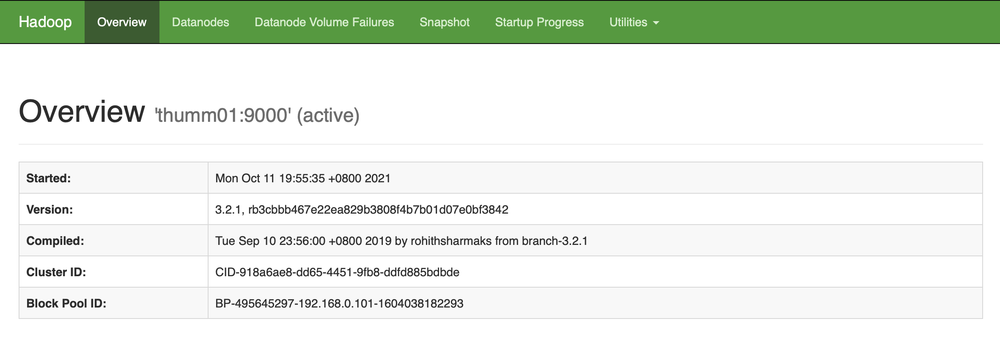
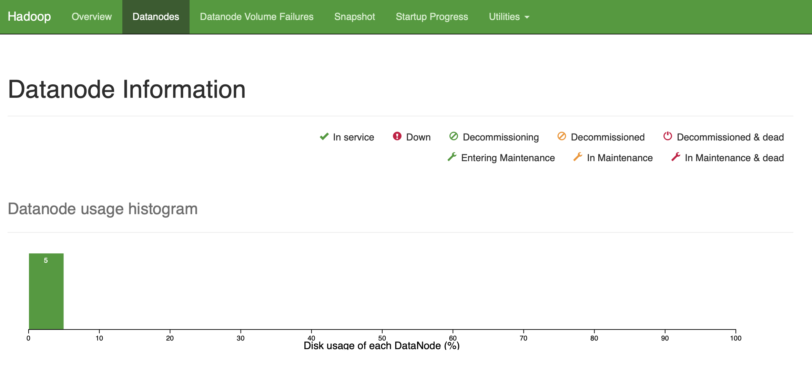

# 实验二 Hadoop 并行编程


## 一、实验目标

本次实验旨在帮助学生补全一个简单的Distributed File System (DFS) 并在其上实现MapReduce框架。具体任务如下：

* 了解 Hadoop 分布式文件系统常用指令（1 分）；
* 补全一个简单的分布式文件系统并添加容错功能（6 分）；
* 在自己设计的分布式文件系统上实现MapReduce 框架（5 分）。

## 二、掌握Hadoop DFS常用指令

### 1. Hadoop使用方法

在服务器上，我们通过Linux 指令对本地文件系统进行操作，如使用`ls` 查看文件/目录信息、使用`cp` 进行文件复制、使用`cat` 查看文件内容。在分布式文件系统中，也有一套相似的指令，接下来我们需要掌握一些基本的指令。（本题 1 分）

首先查看Hadoop DFS 支持的指令：

```bash
szxie@thumm01:~$ hadoop fs
Usage: hadoop fs [generic options]
[-cat [-ignoreCrc] <src > ...]
[-copyFromLocal [-f] [-p] [-l] [-d] [-t <thread count >] <localsrc > ... <dst >]
[-copyToLocal [-f] [-p] [-ignoreCrc] [-crc] <src > ... <localdst >]
[-cp [-f] [-p | -p[topax]] [-d] <src > ... <dst >]
[-head <file >]
[-help [cmd ...]]
[-ls [-C] [-d] [-h] [-q] [-R] [-t] [-S] [-r] [-u] [-e] [<path > ...]]
[-mkdir [-p] <path > ...]
[-moveFromLocal <localsrc > ... <dst >]
[-moveToLocal <src > <localdst >]
[-mv <src > ... <dst >]
[-rm [-f] [-r|-R] [-skipTrash] [-safely] <src > ...]
[-rmdir [--ignore -fail -on-non -empty] <dir > ...]
......
```

上面是DFS 中常用的指令，这些指令中有一些我们在本地文件系统中也用过，如`ls、cp、mv、rm、mkdir、cat、head`，还有一些指令是DFS 特有的，例如`copyFromLocal`、`copyToLocal`，主要用于DFS 与本地文件系统的数据交换。接下来使用`ls` 指令查看DFS 中根目录下文件/文件夹的信息：

```bash
2020214210@thumm01:~$ hadoop fs -ls /
Found 2 items
drwxr-xr-x   - root  supergroup          0 2021-10-05 12:42 /dsjxtjc
drwxrwxrwx   - jtliu supergroup          0 2020-12-21 23:25 /tmp
```

可以看到，现在DFS 根目录下一共有两项，其中`words.txt` 是一个数据集，`dsjxtjc` 是一个文件夹，在这个文件夹下面有每位同学的文件夹，例如某位同学的学号是`202121xxxx`，那么TA对应的文件夹为`/dsjxtjc/202121xxxx/`。为了保证实验过程中不同用户之间不会产生干扰，每位同学只能在自己的文件夹下进行操作。下面查看自己的文件下的内容：

```bash
2020214210@thumm01:~$ hadoop fs -ls /dsjxtjc/2020214210
2020214210@thumm01:~$
```

接下来在本地创建一个`test.txt` 文件：

```bash
2020214210@thumm01:~$ touch test.txt
2020214210@thumm01:~$ echo "Hello Hadoop" > test.txt
2020214210@thumm01:~$ cat test.txt
Hello Hadoop
2020214210@thumm01:~$
```

将本地文件传输至DFS 中：

```bash
2020214210@thumm01:~$ hadoop fs -copyFromLocal ./test.txt /dsjxtjc/2020214210/
2021-10-11 20:15:04,136 INFO sasl.SaslDataTransferClient: SASL encryption trust check: localHostTrusted = false, remoteHostTrusted = false
2020214210@thumm01:~$ hadoop fs -cat /dsjxtjc/2020214210/test.txt
2021-10-11 20:15:26,045 INFO sasl.SaslDataTransferClient: SASL encryption trust check: localHostTrusted = false, remoteHostTrusted = false
Hello Hadoop
```

可以看到文件以及传输到DFS 上。`copyFromLocal/copyToLocal `用于本地文件系统与DFS之间文件的复制，`moveFromLocal/moveToLocal` 用于本地文件系统与DFS 之间文件的移动，这些指令的详细用法可以使用`-help` 指令查看，例如我们想了解`copyFromLocal `的用法：

```bash
2020214210@thumm01:~$ hadoop fs -help copyFromLocal
-copyFromLocal [-f] [-p] [-l] [-d] [-t <thread count>] <localsrc> ... <dst> :
  Copy files from the local file system into fs. Copying fails if the file already
  exists, unless the -f flag is given.
  Flags:

  -p                 Preserves access and modification times, ownership and the
                     mode.
  -f                 Overwrites the destination if it already exists.
  -t <thread count>  Number of threads to be used, default is 1.
  -l                 Allow DataNode to lazily persist the file to disk. Forces
                     replication factor of 1. This flag will result in reduced
                     durability. Use with care.
  -d                 Skip creation of temporary file(<dst>._COPYING_).
```

可以看到该指令有两个必填参数，第一个参数是本地路径，第二个参数是DFS 路径。

### 2. 通过Web 查看Hadoop 运行情况

在本地运行如下命令（将服务器的9870 端口映射到本地的9870 端口）：

```bash
(base) ➜  ~ ssh szxie@10.103.9.11 -L 9870:192.168.0.101:9870
Welcome to Ubuntu 16.04.6 LTS (GNU/Linux 4.4.0-210-generic x86_64)

 * Documentation:  https://help.ubuntu.com
 * Management:     https://landscape.canonical.com
 * Support:        https://ubuntu.com/advantage

70 个可升级软件包。
2 个安全更新。

New release '18.04.6 LTS' available.
Run 'do-release-upgrade' to upgrade to it.


*** 需要重启系统 ***
Last login: Mon Oct 11 19:28:35 2021 from 10.61.237.158
szxie@thumm01:~$ 
```

在本地的浏览器中输入`localhost:9870` 打开9870 端口，即可查看hadoop 运行情况，可通过此界面查看hadoop 的一些基本参数和job/task 的完成情况。



<center>图1 Overview</center>



<center>图2 DataNode Information</center>

## 三、分布式文件系统

GFS由一个`master`、多个`chunkserver`组成；用户通过`client`与GFS交互。以下用`NameNode`表示`master`，`DataNode`表示`chunkserver`。文件夹`MyDFS`中实现了一个简单的分布式文件系统，包含了NameNode、DataNode、Client三部分，其中NameNode负责记录文件块的位置（FAT表）， DataNode负责数据的存储与读取，而Client则是用户与DFS交互的接口，详细原理请参考理论课内容和相关论文。但是`client.py`中的代码有缺失。请你根据**提示和题设**补全缺失代码，保证系统能完成以下指令：

- ls <dfs_path> : 显示当前目录/文件信息
- copyFromLocal <local_path> <dfs_path> : 从本地复制文件到DFS
- copyToLocal <dfs_path> <local_path> : 从DFS复制文件到本地
- rm <dfs_path> : 删除DFS上的文件
- format : 格式化DFS

测试流程见**提示**。（本题 6 分）

### 0. MyDFS信息

#### 0.0 目录结构

- MyDFS : 根目录
  - dfs : DFS文件夹，用于存放DFS数据
    - name : 存放NameNode数据
    - data : 存放DataNode数据
      -test : 存放测试样例
      -test.txt
  - common.py  : 全局变量
  - name_node.py : NameNode程序
  - data_node.py : DataNode程序
  - client.py : Client程序，用于用户与DFS交互

#### 0.1 模块功能

- name_node.py
  - 保存文件的块存放位置信息
  - 获取文件/目录信息
  - get_fat_item： 获取文件的FAT表项
  - new_fat_item： 根据文件大小创建FAT表项
  - rm_fat_item： 删除一个FAT表项
  - format: 删除所有FAT表项

- data_node.py
  - load 加载数据块
  - store 保存数据块
  - rm 删除数据块
  - format 删除所有数据块

- client.py
  - ls : 查看当前目录文件/目录信息
  - copyFromLocal : 从本地复制数据到DFS
  - copyToLocal ： 从DFS复制数据到本地
  - rm ： 删除DFS上的文件
  - format ：格式化DFS

### 0.2 操作示例

0. 进入MyDFS目录

   ```sh
   $ cd MyDFS
   ```

1. 启动NameNode

	```sh
	$ python3 name_node.py
	```

2. 启动DataNode

   ```sh
   $ python3 data_node.py
   ```

3. 使用copyFromLocal指令；

   ```sh
   $ python3 client.py -copyFromLocal test/test.txt /test/test.txt
   File size: 8411
   Request: new_fat_item /test/test.txt 8411
   Fat:
   blk_no,host_name,blk_size
   0,localhost,4096
   1,localhost,4096
   2,localhost,219
   ```

   启动blk_no为块号， host_name为该数据块存放的主机名字，blk_size为块的大小。

### 1. copyFromLocal （例）

`copyFromLocal`的功能是将本地文件传到DFS之中。具体来说，`client`会把文件信息通过`new_fat_item`指令给NameNode，NameNode根据文件大小分配空间，并将相应空间信息以FAT表的形式返回给`client.py`（详见`name_node.py`中的`new_fat_item`函数）；接着，Client 根据FAT表和目标DataNodes逐个建立连接发送数据块。本题为例题，**提示**中给出了`copyFromlocal`的输出。（0 分）

```python
def copyFromLocal(self, local_path, dfs_path):
        file_size = os.path.getsize(local_path)
        print("File size: {}".format(file_size))
        
        request = "new_fat_item {} {}".format(dfs_path, file_size)
        print("Request: {}".format(request))
        
        # 从NameNode获取一张FAT表
        self.name_node_sock.send(bytes(request, encoding='utf-8'))
        fat_pd = self.name_node_sock.recv(BUF_SIZE)
        
        # 打印FAT表，并使用pandas读取
        fat_pd = str(fat_pd, encoding='utf-8')
        print("Fat: \n{}".format(fat_pd))
        fat = pd.read_csv(StringIO(fat_pd))
        
        # 根据FAT表逐个向目标DataNode发送数据块
        fp = open(local_path)
        for idx, row in fat.iterrows():
            data = fp.read(int(row['blk_size']))
            
            data_node_sock = socket.socket()
            data_node_sock.connect((row['host_name'], data_node_port))
            blk_path = dfs_path + ".blk{}".format(row['blk_no'])
            
            request = "store {}".format(blk_path)
            data_node_sock.send(bytes(request, encoding='utf-8'))
            time.sleep(0.2)  # 两次传输需要间隔一段时间，避免粘包
            data_node_sock.send(bytes(data, encoding='utf-8'))
            data_node_sock.close()
        fp.close()
```

### 2. copyToLocal

`copyToLocal`是`copyFromLocal`的反向操作，请你参考例题、阅读`name_node.py`中的`get_fat_item`和`data_node.py`中的`load`函数，补全`client.py`中的`copyToLocal`函数。（1 分）

```python
def copyToLocal(self, dfs_path, local_path):
    request = "get_fat_item {}".format(dfs_path)
    print("Request: {}".format(request))
    # TODO: 从NameNode获取一张FAT表；打印FAT表；根据FAT表逐个从目标DataNode请求数据块，写入到本地文件中
```

### 3. ls

Client 会向NameNode 发送请求，查看`dfs_path`下的文件或文件夹信息，请完善`client.py`中的`ls`函数（如下），使其实现上述功能，并能打印错误（使用`try...error`语句）。（1 分）

```python
def ls(self, dfs_path):
    cmd = "ls {}".format(dfs_path)
    print("Request: {}".format(request))
    # TODO: 将cmd发送给name node，接收name node返回的文件信息并打印
```

### 4. rm

`rm`则是要删除相应路径的文件。请大家阅读`name_node.py`中的`rm_fat_item`和`data_node.py`中的`rm`函数补全`client.py`中的`rm`函数。（1 分）

```python
def rm(self, dfs_path):
    request = "rm_fat_item {}".format(dfs_path)
    print("Request: {}".format(request))
    # 从NameNode获取改文件的FAT表，获取后删除；打印FAT表；根据FAT表逐个告诉目标DataNode删除对应数据块
```

### 5. data replication

其实这个DFS的`dfs_replication`为`1`，也就是一个数据块存储在一台主机上，请大家修改common.py里的配置，以及namenode.py、datanode.py、client.py中对应的部分，实现存储多副本块存储，推荐`dfs_replication=3`，在5台机器上测试。（1 分）

==检查点==

### 6. HeartBeat

GFS中提到，NameNode会定期与每个DataNode进行交流，确认DataNode的状态，这个过程被称为`HeartBeat`，很多分布式系统都有这个功能。请大家修改`name_node.py`和`data_node.py`，添加`HeartBeat`功能，保证某个DataNode突然挂了后，NameNode能及时输出错误信息，并对丢失的文件进行备份，保证`data_replication`不变。请说明你的解决方案，解释相关代码并展示测试结果。（2 分）

#### 6.1 Bonus

参考理论课内容或者其他论文，实现其他容错功能。（附加题，2 分）

### 提示

* 实验中可能会碰到粘包现象，`copyFromLocal`代码中给出了可参考的处理方法；

* 实际测试中可以手动结束一个worker的进程来制造`DataNode`挂了的现象；

* 任务6可以考虑使用multiprocess module，NameNode应该维护所有DataNode的`回复时间`和`host_name`；在开启DataNode的同时开启轮询进程， 每隔一段时间需要收到DataNode的响应，否则认定该DataNode已经死去，当然还可以用其他方式比如NameNode每隔一段时间询问DataNode实现，但是并不能算是其他容错功能；

* `common.py`中的`data_node_port`和`name_node_port`大家可以使用学号后四位或者五位，以免端口冲突；

* 在一台机器上测试本题任务1～4的功能即可，大家可以在自己的设备上运行；

* 请在两台机器上测试任务5的功能，并截图放入实验报告中，可以使用`test`文件夹中的`test.txt`做为测试文件，流程可以参考：

  * 在两台机器上测试`copyFromLocal`功能

    * 进入`MyDFS`目录，在thumm01上启动NameNode和DataNode，在thumm02上启动DataNode（此步骤无需截图）：

      ```bash
      szxie@thumm01:~/MyDFS$ python3 NameNode.py
      Name node started
      ```

      ```bash
      szxie@thumm01:~/MyDFS$ python3 DataNode.py
      
      ```
      ```bash
      szxie@thumm02:~/MyDFS$ python3 DataNode.py
      
      ```
    
  * 在Terminal 4 (thumm01)中输入（需截图）：
    
    ```bash
    szxie@thumm01:~/MyDFS$ python3 client.py -copyFromLocal /home/szxie/MyDFS/test/test.txt /test.txt
    ```
    
    * 输出（需截图）：
    
      Terminal 1 (NameNode-thumm01):
    
      ```bash
      szxie@thumm01:~/MyDFS$ python3 name_node.py 
      Name node started
      connected by ('127.0.0.1', 51554)
      Request: ['new_fat_item', '/test.txt', '8411']
      8411 3
      Response: blk_no,host_name,blk_size
      0,thumm02,4096
      0,thumm01,4096
      1,thumm02,4096
      1,thumm01,4096
      2,thumm01,219
      2,thumm02,219
      ```
    
      Terminal 2 (DataNode-thumm01):
    
      ```bash
      szxie@thumm01:~/MyDFS$ python3 data_node.py
      Received request from ('192.168.0.101', 60126)
      ['store', '/test.txt.blk0']
      Received request from ('192.168.0.101', 60130)
      ['store', '/test.txt.blk1']
      Received request from ('192.168.0.101', 60132)
      ['store', '/test.txt.blk2']
      ```
      
      Terminal 3 (DataNode-thumm02): 
    
      ```bash
      szxie@thumm02:~/MyDFS$ python3 data_node.py 
      Received request from ('192.168.0.101', 52352)
      ['store', '/test.txt.blk0']
      Received request from ('192.168.0.101', 52356)
      ['store', '/test.txt.blk1']
      Received request from ('192.168.0.101', 52362)
      ['store', '/test.txt.blk2']
      ```
      
      Terminal 4 (Client-thumm01): 
      ```bash
      szxie@thumm01:~/MyDFS$ python3 client.py -copyFromLocal /home/szxie/MyDFS/test/test.txt /test.txt
      File size: 8411
      Request: new_fat_item /test.txt 8411
      Fat: 
      blk_no,host_name,blk_size
      0,thumm02,4096
      0,thumm01,4096
      1,thumm02,4096
      1,thumm01,4096
      2,thumm01,219
      2,thumm02,219
      
      szxie@thumm01:~/MyDFS$ 
      ```
    
      大家请把相应部分截图放入实验报告。
  
* 如果你不想用python，或者不满足于实验指导中给出的DFS架构，也可以（用自己偏爱的语言）重新写一个DFS并实现HearBeat容错。之后的MapReduce任务也可在其上完成。请在实验报告中叙述你的设计思想，并解释关键代码。

* 建议大家尽早开始后续实验，临近ddl机器应该会很卡...

## 四、MapReduce

在DFS上实现MapReduce框架（本题 5 分）。

要求：

1. 支持计算均值和方差这两个功能；
2. 有4-5台机器参与计算；
3. 请在实验报告中详细叙述你的设计思想，数据分割方案，任务分配和整合方案等细节，并解释关键代码，将你对MapReduce的理解毫无保留的展现出来。

### 提示 

* 和单机的处理结果比对，说明MapReduce结果正确；

## 五、报告提交

请严格按照以下要求提交实验报告。

1. 简要描述数据集含义，用**粗体**标出数据集的大小（单位GB）和存放路径；

2. 将命令和结果截图（或复制输入输出）放入报告，实验报告需为pdf 格式（命名为`学号_姓名_实验二.pdf`，例如：`2021200000_张三_实验二.pdf`），连同代码文件一同打包成压缩文件（命名为`学号_姓名_实验二.*`，例如：`2021200000_张三_实验二.zip`），最后上交到网络学堂。压缩文件中文件目录应为（示例）：

   ```bash
   .
   |-- 学号_姓名_实验二.pdf
   `-- MyDFS
       |-- client.py
       |-- common.py
       |-- control
       |-- data_node.py
       |-- dfs
       |   |-- data
       |   |-- mapjobs
       |   `-- name
       |-- mapreduce.py
       |-- name_node.py
       |-- __pycache__
       |   `-- common.cpython-35.pyc
       |-- README.md
       |-- test
       |   |-- test2.txt
       |   `-- test.txt
       `-- var.txt
   ```
   
3. 【二、掌握Hadoop DFS常用指令】需要截图或粘贴命令行输入和输出，通过Web查看Hadoop状态也需要给出截图；

4. 【三、分布式文件系统】请在实验报告中贴出关键代码，并解释；

5. 【四、MapReduce】需要提交代码文件夹；

6. 本次实验所有题目都不会用到root权限；

7. 迟交作业一周以内，以50% 比例计分；一周以上不再计分。另一经发现抄袭情况，零分处理。